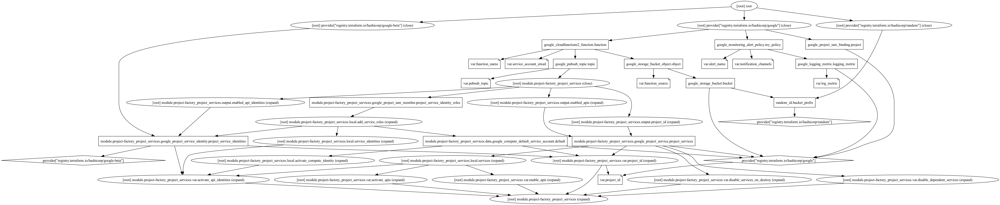

## Google Cloud Platform security command center alerts

This project uses Terraform to set up a Google Cloud Platform (GCP) environment for Security Command Center alerts. The alerts will be notify through an existing Slack Channel.

## Features
- Sets up required Terraform providers for GCP.
- Creates a random ID for bucket prefix. (Bucket name must me globally unique)
- Enables [Eventarc API](https://cloud.google.com/eventarc/docs/reference/rest) for the project.
- Creates a Google Pub/Sub topic.
- Creates a Google Storage Bucket with a unique name.
- Uploads a zipped function source code to the created bucket.
- Binds the IAM role `roles/cloudfunctions.developer` to the project.
- Creates a Google Cloud Function (2nd gen).
- Sets up alert conditions and strategies.
- Alerts will be available in a Slack Channel.
- Provides a link to access the Security Command Center in the alert documentation.

## Google Cloud Resources

 Random ID for Bucket Prefix:
- Generates a random hex string to ensure a unique bucket name.

 Project Services Module:
- Enables the Eventarc API on the GCP project.

 Pub/Sub Topic:
- Creates a Pub/Sub topic for event triggering.

 Cloud Storage Bucket:
- Creates a Cloud Storage bucket for storing the function source code.

 Cloud Storage Bucket Object:
- Uploads the specified cloud function's source code to the Cloud Storage bucket.

 IAM Role Binding:
- Binds the `cloudfunctions.developer` role to a service account for Cloud Functions.

 Cloud Function:
- Deploys a Cloud Function triggered by Pub/Sub messages.
- Configures build settings, service account, and event trigger.

 Logging Metric:
- Creates a Logging metric based on specified log filter conditions.

 Monitoring Alert Policy:
- Creates a Monitoring alert policy based on the Logging metric.
- Specifies notification channels and documentation URL.


## Usage
1. Make sure you have Terraform installed on your machine.
2. Clone this repository.
3. Navigate to the project directory.
4. Run `gcloud auth application-default login` to authenticate with GCP.
5. Update the `variables.tf` file with your project details.
6. Run `terraform init` to initialize your Terraform workspace.
7. Run `terraform apply` to create the resources on GCP.

### Example 

```
module "scc-alerts" {
  source                = "path_to_module"
  project_id            = "gcp_project_id"
  function_source       = "${path.module}/function-source.zip"
  service_account_email = "service_account_for_cloud_function"
  notification_channels = "slack_channel_id"
}
```

Please note that you need to have the appropriate permissions to create and manage the above resources in your GCP project.

## License
This project is licensed under the MIT License. See the `LICENSE` file for details.

---

## Terraform Graph



This graph was generated using [Graphviz](https://graphviz.org/).
<!-- BEGIN_TF_DOCS -->
## Requirements

| Name | Version |
|------|---------|
| <a name="requirement_google"></a> [google](#requirement\_google) | >= 4.34.0 |

## Providers

| Name | Version |
|------|---------|
| <a name="provider_google"></a> [google](#provider\_google) | >= 4.34.0 |
| <a name="provider_random"></a> [random](#provider\_random) | n/a |

## Modules

| Name | Source | Version |
|------|--------|---------|
| <a name="module_project-factory_project_services"></a> [project-factory\_project\_services](#module\_project-factory\_project\_services) | terraform-google-modules/project-factory/google//modules/project_services | 14.2.0 |

## Resources

| Name | Type |
|------|------|
| [google_cloudfunctions2_function.function](https://registry.terraform.io/providers/hashicorp/google/latest/docs/resources/cloudfunctions2_function) | resource |
| [google_logging_metric.logging_metric](https://registry.terraform.io/providers/hashicorp/google/latest/docs/resources/logging_metric) | resource |
| [google_monitoring_alert_policy.my_policy](https://registry.terraform.io/providers/hashicorp/google/latest/docs/resources/monitoring_alert_policy) | resource |
| [google_project_iam_binding.project](https://registry.terraform.io/providers/hashicorp/google/latest/docs/resources/project_iam_binding) | resource |
| [google_pubsub_topic.topic](https://registry.terraform.io/providers/hashicorp/google/latest/docs/resources/pubsub_topic) | resource |
| [google_storage_bucket.bucket](https://registry.terraform.io/providers/hashicorp/google/latest/docs/resources/storage_bucket) | resource |
| [google_storage_bucket_object.object](https://registry.terraform.io/providers/hashicorp/google/latest/docs/resources/storage_bucket_object) | resource |
| [random_id.bucket_prefix](https://registry.terraform.io/providers/hashicorp/random/latest/docs/resources/id) | resource |

## Inputs

| Name | Description | Type | Default | Required |
|------|-------------|------|---------|:--------:|
| <a name="input_alert_name"></a> [alert\_name](#input\_alert\_name) | Alert Name | `string` | `"Security Command Center Alerts"` | no |
| <a name="input_function_name"></a> [function\_name](#input\_function\_name) | Name of the Cloud Function | `string` | `"scc-alerts"` | no |
| <a name="input_function_source"></a> [function\_source](#input\_function\_source) | Cloud Function source code path | `any` | n/a | yes |
| <a name="input_log_metric"></a> [log\_metric](#input\_log\_metric) | n/a | `string` | `"scc-alerts"` | no |
| <a name="input_notification_channels"></a> [notification\_channels](#input\_notification\_channels) | Notification channels ID of Slack channel | `string` | `""` | no |
| <a name="input_project_id"></a> [project\_id](#input\_project\_id) | GCP project id | `string` | `""` | no |
| <a name="input_pubsub_topic"></a> [pubsub\_topic](#input\_pubsub\_topic) | Pubsub topic name | `string` | `"scc-alerts"` | no |
| <a name="input_service_account_email"></a> [service\_account\_email](#input\_service\_account\_email) | IAM service account email for the Cloud Function | `any` | n/a | yes |

## Outputs

No outputs.
<!-- END_TF_DOCS -->
